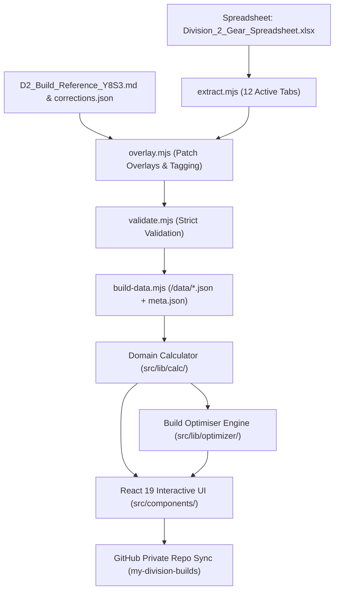

# Division Config — Division 2 Build Optimiser

A mathematically rigorous build optimiser and damage calculator for **Tom Clancy's The Division 2**, updated and verified for **Year 8 Season 3: "Red Horizon" (TU30 / Patch 2.34)**.

Built with React 19, TypeScript, Vite 6, and TailwindCSS. Deployed automatically to GitHub Pages.

---

## Key Features

- **Accurate Damage Stacking Engine**: Enforces exact multiplier group mechanics: intra-group additions ($1 + \sum \text{bonuses}$), inter-group multiplications, and independent multiplicative amplifiers ($\prod(1 + \text{amp}_i)$).
- **Legality & Recalibration Enforcement**: Real-time validation of Division 2 itemisation constraints (1 recalibration per item limit, gear set core color locking, gear set 1-minor attribute budget trade-off, named gear locked perfect talents, mod slot validity).
- **Verified Community Corrections**: Overrides unverified community spreadsheet entries with official patch documentation (e.g. Lengmo 1pc 15% Reload, China Light 2pc 20% Status Effects, Electrique 2pc 20% Hazard Protection, 5.11 Tactical 1pc 12% Protection from Elites).
- **Full Red Horizon Dataset**: Native support for *Fafnir*, *Iron Will*, *Trick Shot*, *Rushdown*, *Melon Baller*, *Keeper*, *Teapot*, *Steamer*, *Ember Engine*, *Boiling Point*, and the *Determined* rework.
- **Constraint-Based Build Optimiser**: Combinatorial search with fast pruning across primary objectives (Max Sustained DPS, Max Burst DPS, Max Bullet Hit, Max Plague DoT, Max Status Duration, Max Armor/DPS balance) with plain-English trade-off explanations.
- **Side-by-Side Comparison Matrix**: Direct delta comparisons showing the mathematical impact of swapping gear pieces, set tiers, and talents.
- **Private Zero-Telemetry Persistence**: Connects directly to personal GitHub accounts to store and synchronise builds in a private repository (`my-division-builds`). No third-party servers, user tracking, or telemetry.

---

## Architecture & Data Flow



---

## The Damage Stacking Model

The engine groups bonuses into canonical multiplier categories to calculate expected bullet and skill output:

$$\text{Effective Hit} = \text{Base Damage} \times (1 + \text{WD}) \times (1 + \text{TWD}) \times (1 + \text{CHC} \times \text{CHD}) \times \prod_{i=1}^{k}(1 + \text{Amp}_i)$$

- **Critical Hit Chance (CHC)**: Engine hard cap at **60.0%**. Any further roll provides zero contribution and triggers an alert.
- **Critical Hit Damage (CHD)**: Base is 25%. Stacks additively within the critical hit factor.
- **Independent Amplifiers**: Talents such as *Overdogs* (+30% vs lowest-tier), *Spotter* (+15%/+20%), *Glass Cannon* (+25%/+30%), *Striker's Gamble* (+0.9%/stack), and *True Patriot Red Flag* (+30%) are always isolated multiplicative factors.
- **Pestilence Plague of the Outcasts**: Debuff dealing 100% weapon damage over 10s per stack (up to 50 stacks). Scales with Weapon Damage and Amplifiers, but **does not crit**.

---

## Reference Builds (Worked Proofs)

1. **Build A: Pestilence Red DPS**
   - *Gear*: 4pc Tipping Scales (Chest *Sustainability* + Backpack *Snowball*) + Coyote's Mask + Overdogs.
   - *Proof*: Expands Pestilence magazine from 100 to 130 rounds (2pc 30% Mag Size), maintaining continuous fire to build 50 Plague stacks and 75 Throttle Control stacks (+600% CHD). Outdamages Heartbreaker in raw bullet output by ~1.8×.
2. **Build B: Eclipse Protocol Group Control**
   - *Gear*: 4pc Eclipse Protocol + Vile Mask + *The Courier* (Habsburg named backpack with Perfect Creeping Death, core recalibrated to Skill Tier).
   - *Proof*: Creeping Death triggers on **application** during room entry, providing immediate crowd lockdown. Drops *Symptom Aggravator* (+30% personal damage) because CC players deal negligible damage in coordinated groups.
3. **Build B2: Eclipse Protocol Solo Control**
   - *Gear*: 4pc Eclipse Protocol + Vile Mask + Eclipse Backpack (*Symptom Aggravator*) + 1pc Electrique.
   - *Proof*: Restores the 30% all-damage amplifier when personal damage output matters.
4. **Build C: Support 3-Man**
   - *Gear*: 4pc Future Initiative (Chest + Backpack) + BTSU Datagloves + 1pc Alps/Edelweiss.
   - *Proof*: Provides +25% Total Weapon & Skill Damage to whole team at full armor uptime, with 120% repair splash.
5. **Build D: True Patriot Team Debuff**
   - *Gear*: 4pc True Patriot (Chest *Waving the Flag* + Backpack *Patriotic Boost*) + Overdogs + Fox's Prayer + Bullet King.
   - *Proof*: Red Flag applies a 30% amplifier to damage taken by targets from all team sources, while Bullet King provides sustained flag uptime without reloading.

---

## Local Development & Build Scripts

```bash
# 1. Install dependencies
npm install

# 2. Extract and validate game dataset
npm run build:data

# 3. Run complete test suite (pipeline, math, optimizer, storage, PII)
npm test

# 4. Start local development server
npm run dev

# 5. Compile production bundle
npm run build
```

---

## Privacy & Security

- **Zero PII**: No hardcoded usernames, machine paths, or organizational identifiers.
- **Direct User Storage**: Saved builds are stored in `localStorage` and synchronised directly with your personal GitHub account in a private repository (`my-division-builds`).
- **No Third-Party Backend**: Static site execution with client-side cryptography and calculation.

---

## License

MIT License. See [LICENSE](./LICENSE) for details.
