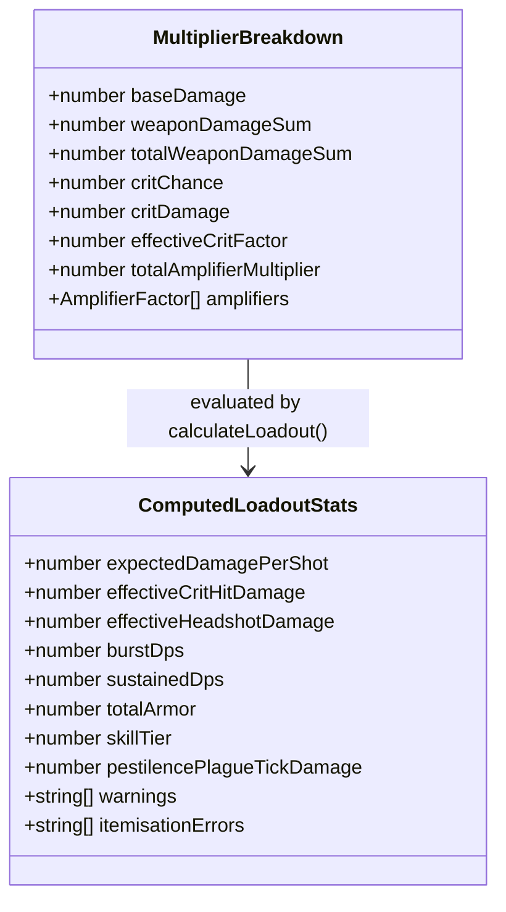

# System Architecture & Design

This document details the software architecture, data processing pipeline, and domain calculation model of **Division Config**.

---

## 1. High-Level System Architecture

```mermaid
graph TD
    subgraph Data Pipeline [Data Extraction & Verification]
        A["Spreadsheet (Division_2_Gear_Spreadsheet.xlsx)"] --> B["extract.mjs (12 Tabs Extracted)"]
        C["D2_Build_Reference_Y8S3.md & corrections.json"] --> D["overlay.mjs (Patch Overlays & Tagging)"]
        B --> D
        D --> E["validate.mjs (Structural Validation)"]
        E --> F["build-data.mjs (/data/*.json + meta.json)"]
    end

    subgraph Calculation Engine [Domain Logic (src/lib/calc/)]
        F --> G["loadout-calculator.ts"]
        G --> H["multipliers.ts (Intragroup / Intergroup)"]
        G --> I["special-cases.ts (Stacks & Status)"]
        G --> J["caps.ts (60% CHC Hard Cap & Immunities)"]
        G --> K["constraints.ts (Legality & Recalibration)"]
    end

    subgraph User Interface [React 19 + TailwindCSS (src/components/)]
        G --> L["Loadout Editor (GearSlotCard / WeaponSlotCard)"]
        G --> M["StatsPanel (Live Multipliers & Stacking Tree)"]
        G --> N["CombatContextBar (Distance, Solo/Group, Stacks)"]
        G --> O["OptimizerView (Combinatorial Search & Ranking)"]
        G --> P["ComparisonView (Side-by-Side Delta Matrix)"]
        G --> Q["SavedBuildsView (Local & GitHub Sync)"]
        G --> R["AdvisorChat (ISAC-B Tactical Rule Advisor)"]
    end

    subgraph User Storage [Zero-Telemetry Persistence]
        Q --> S["Browser LocalStorage"]
        Q --> T["GitHub REST API (my-division-builds private repo)"]
    end
```

---

## 2. Damage Calculation Multiplier Model

Damage output is calculated through isolated mathematical multiplier pools:

$$\text{Effective Hit} = \text{Base Damage} \times (1 + \text{WD}) \times (1 + \text{TWD}) \times (1 + \text{CHC} \times \text{CHD}) \times \prod_{i=1}^{k}(1 + \text{Amp}_i)$$



---

## 3. Data Integrity & Verification Tiers

Data sources and confidence ratings flow from authoritative patch releases to community data:

1. **`[PDF]`**: Official Title Update Patch Notes & Release documentation (authoritative).
2. **`[UBI]`**: Official Ubisoft developer communications and live stream confirmations.
3. **`[SHEET]`**: Community spreadsheet entries unverified against official patch notes.
4. **`[?]`**: Open mechanical questions and conflicting community observations.
